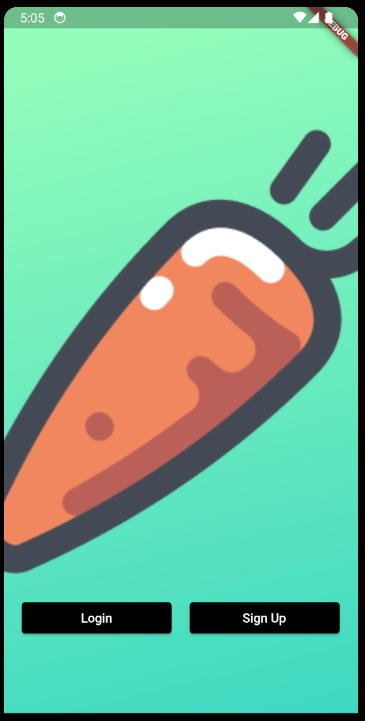
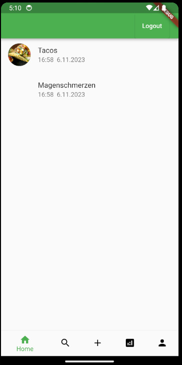
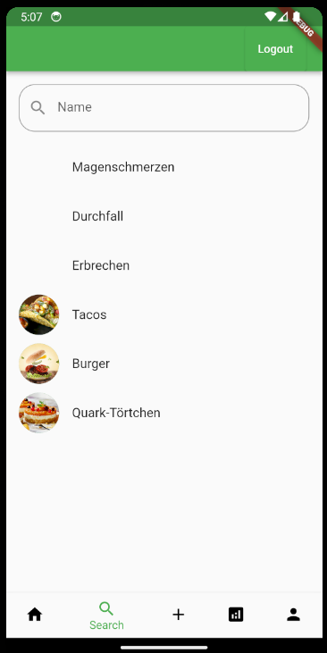
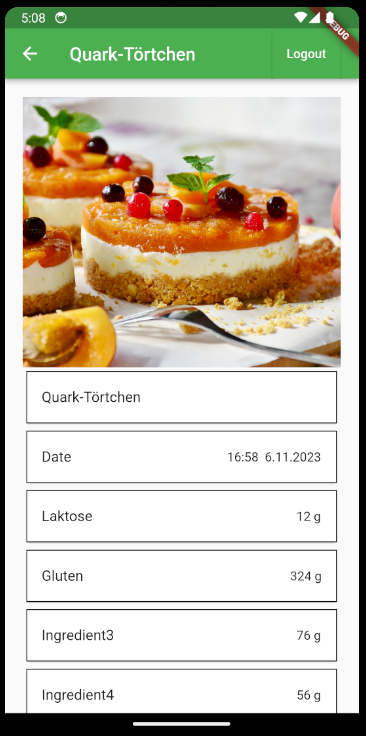
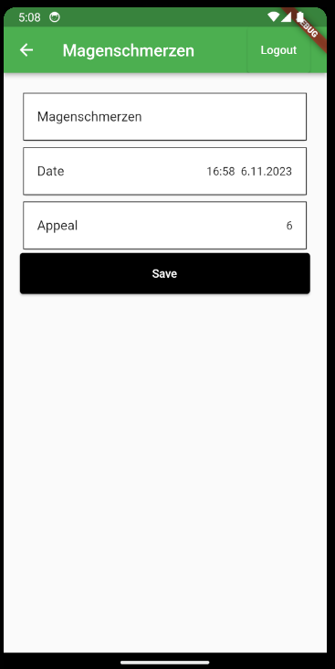
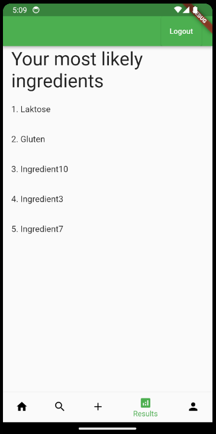

# nutritiolyzer

Nutritiolyzer is a Flutter app designed to simplify the tracking of substances in food, aiming to aid in identifying intolerances. It features a login/logout mechanism, a homepage that provides an overview of the food consumed and the corresponding symptoms experienced in chronological order. As an example, three menus and three symptoms have been implemented, which can be added and fully configured on a separate page.

The app also includes a search function for pre-existing symptoms and menus, as well as a purely visual listing of the most frequently consumed ingredients. Furthermore, there's a profile view where users can modify their username, email, date of birth, gender, phone number, and password.

## Getting Started

This project is a starting point for a Flutter application.

A few resources to get you started if this is your first Flutter project:

- [Lab: Write your first Flutter app](https://docs.flutter.dev/get-started/codelab)
- [Cookbook: Useful Flutter samples](https://docs.flutter.dev/cookbook)

For help getting started with Flutter development, view the
[online documentation](https://docs.flutter.dev/), which offers tutorials,
samples, guidance on mobile development, and a full API reference.

## Login

## Home

## Search

## Add Meal or Issue

## Example Meal

##Example Issue

## Most likely Ingredients

## Account

